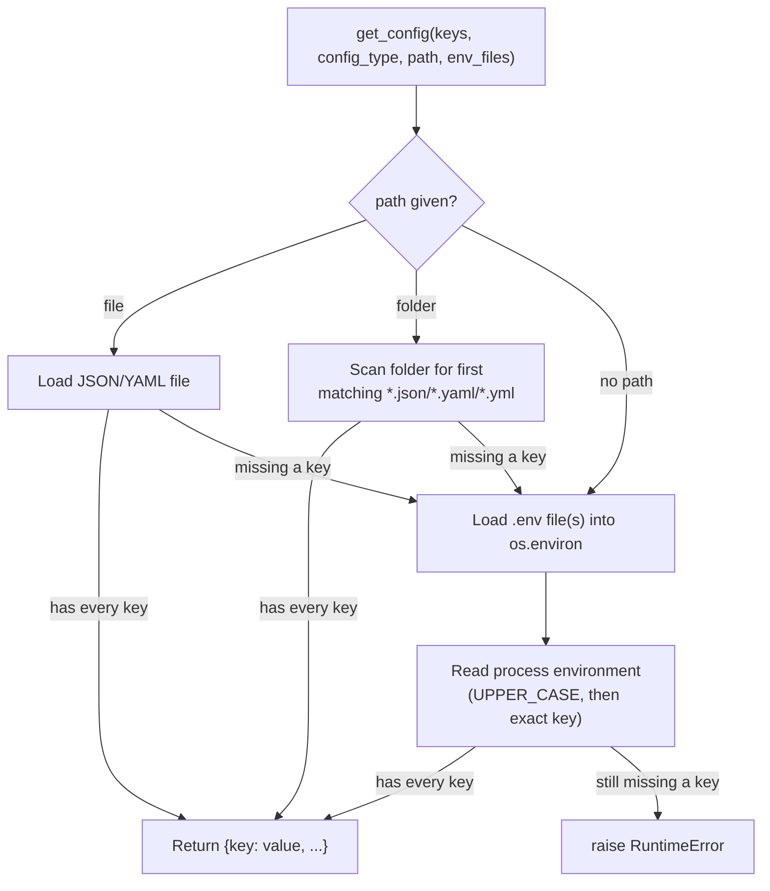
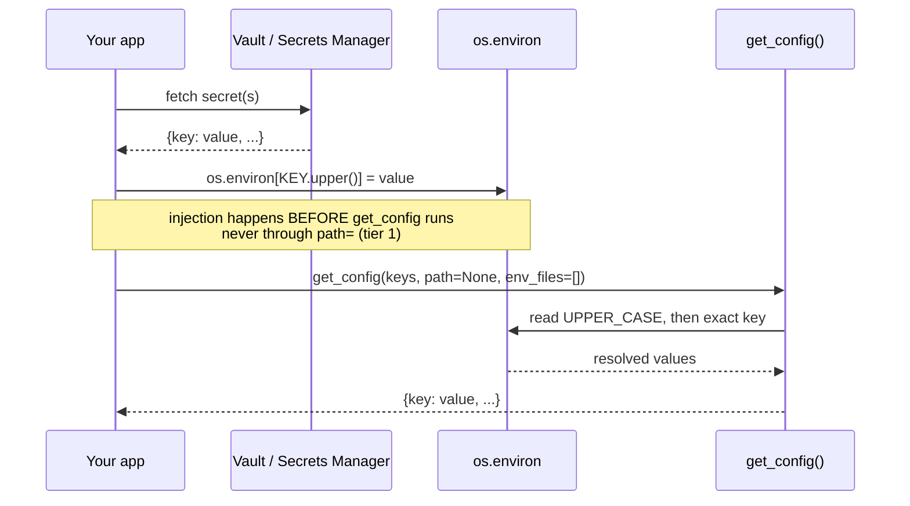

# Credentials Management — OS Helper

[🇫🇷](https://github.com/warith-harchaoui/os-helper/blob/main/GESTION_DES_CREDENTIALS.md) · [🇬🇧](https://github.com/warith-harchaoui/os-helper/blob/main/CREDENTIALS_MANAGEMENT.md)

`os-helper` is not a secrets manager, and does not try to be one. It has no
encryption, no OS keychain integration, no secrets-manager client, and no
built-in `.gitignore` enforcement. This document is the honest account of
what it *does* do with credentials, and the recommended pattern for layering
a real vault (HashiCorp Vault, AWS Secrets Manager, GCP Secret Manager,
Azure Key Vault, ...) on top.

---

## Table of Contents

1. [What os-helper Does Today](#what-os-helper-does-today)
2. [Combining `get_config` with a Vault](#combining-get_config-with-a-vault)
3. [Security Checklist](#security-checklist)
4. [See Also](#see-also)

---

## What os-helper Does Today

The only credential-adjacent surface in the library is
[`get_config()`](os_helper/config_utils.py); everything else (hashing,
downloads, remote staging) is either unrelated or explicitly documented
below.

### `get_config`'s three-tier fallback

`get_config()` resolves a set of required keys through a fixed, deterministic
order; see [EXAMPLES.md § Configuration Loading](EXAMPLES.md#configuration-loading)
for the full API:

1. an explicit JSON/YAML file, or the first matching file in a folder;
2. one or more `.env` files, merged into `os.environ` via `python-dotenv`;
3. plain process environment variables (`UPPER_CASE` tried first, then the
   exact key as given).

It returns the resolved values as a plain `dict[str, str | int | float]`.
**Nothing is encrypted, masked, or redacted in that return value**: the
caller holding the dict holds the raw secret.

### Logging never echoes values

The one thing `get_config` gets right by default: every log line it emits
names the `config_type`, the key names, or a file path, never a resolved
value:

```
Missing keys in environment variables: db_url, api_key
Configuration 'database' successfully loaded from 'config.yaml'
```

So calling `get_config` at any verbosity level won't leak secrets into your
logs. What you do with the returned dict afterwards is on you.



### The HTTP API surface returns raw values

`POST /config` (`os_helper/api.py`) exposes `get_config` over HTTP. Its
docstring is explicit that `path`/`env_files` are paths **on the server's
filesystem**: it is meant for a trusted deployment introspecting its own
local config, not a way to fetch someone else's secrets over the network.
There is no authentication on the endpoint itself: if you expose this API
publicly, any caller who knows the right key names gets the raw values back.
Put it behind your own auth layer (reverse proxy, API gateway) before
exposing it beyond localhost.

### Hashing is not for passwords

`hash_string` / `hashfile` / `hashfolder` use RIPEMD-160 (falling back to
BLAKE2b) for **content hashing**: deduplication, integrity checks, stable
identifiers. There is no salting and no key-stretching (no bcrypt/argon2/
scrypt equivalent). Don't use them to store or verify passwords.

### Remote staging never touches credentials

`temporary_remote_file()` uploads to wherever you point it (S3, GCS, SFTP,
...) via `upload`/`delete` callables *you* supply, already wired to their
own credentials (a boto3 session, a paramiko client, an IAM role). os-helper
never sees, stores, or forwards those credentials.

### No outbound calls carry secrets

Per the README's local-first promise, the only network calls the library
ever makes are `download_file`, `is_working_url`/`check_url`, and
`get_user_ip`. `get_config` never phones home; vault integration (below) is
entirely something you add on top, never a default.

---

## Combining `get_config` with a Vault

`get_config` has no native vault tier: it only knows file, then `.env`,
then process env. The integration point is **tier 3**: fetch secrets from the
vault first, drop them into `os.environ`, then let `get_config` pick them up
as if they had always been there.

```python
import os
import hvac  # or boto3 (Secrets Manager), google-cloud-secret-manager, ...
import os_helper as osh

def load_from_vault(vault_client, mount: str, path: str) -> None:
    secret = vault_client.secrets.kv.v2.read_secret_version(mount_point=mount, path=path)
    for key, value in secret["data"]["data"].items():
        # setdefault, not `=`: an already-set value (however it got there)
        # always wins over the vault, so a developer's .env or shell export
        # keeps overriding it during local work.
        os.environ.setdefault(key.upper(), str(value))  # get_config tries UPPER_CASE first

client = hvac.Client(url="https://vault.internal", token=os.environ["VAULT_TOKEN"])
load_from_vault(client, mount="secret", path="myapp/prod")

# path=None, env_files=[] skips the file and .env tiers entirely:
# straight to the env vars just injected above.
config = osh.get_config(
    keys=["db_url", "api_key"],
    config_type="myapp",
    path=None,
    env_files=[],
)
```

The same pattern applies to any vault client: swap `hvac` for `boto3`'s
`get_secret_value`, `google.cloud.secretmanager`, or `azure.keyvault.secrets`;
only the fetch call changes, not the injection point.

> A dependency-free, runnable version of `load_from_vault` lives at
> [`examples/vault_config.py`](examples/vault_config.py); run it directly
> with `python examples/vault_config.py`. Both decisions below are exercised
> for real (not just asserted in prose) by
> [`tests/test_vault_config_example.py`](tests/test_vault_config_example.py).



### Two decisions worth making deliberately

- **Inject into the environment, never the file tier.** Passing a vault
  fetch through `get_config(path=...)` means writing secret values to disk;
  even a temp file defeats the purpose of a vault. Environment injection
  keeps them in memory only, at the cost of being visible to any subprocess
  `system()` spawns (child processes inherit the environment).

- **Dev/prod parity, if you want it.** Both `load_dotenv()` (tier 2) and
  `os.environ.setdefault` share the same non-destructive rule: whatever key
  is already set wins, the new source only fills gaps. That means ordering
  matters. `load_from_vault` must use `setdefault`, not a hard assignment,
  and "a developer's `.env` overrides vault" only holds for a `.env` that is
  already loaded into `os.environ` *before* `load_from_vault` runs (their
  shell, IDE run config, or `direnv`, not `get_config`'s own `env_files`
  tier, which runs *after* vault injection and would otherwise be blocked
  by it, not the other way around). Get the ordering right and vault becomes
  the floor with zero environment-specific branching: whatever is already
  in the environment wins, vault fills the rest.

---

## Security Checklist

- [ ] Never log the dict `get_config` returns, only the fact that it
      succeeded (the library already follows this rule internally).
- [ ] Never pass vault-fetched secrets through `get_config(path=...)`; that
      writes them to disk. Use environment injection instead.
- [ ] Keep `.env` files out of version control (`os-helper` does not enforce
      this: it's a plain file read, add `.env` to your project's
      `.gitignore` yourself).
- [ ] Don't expose `POST /config` on the HTTP API surface beyond localhost
      without your own authentication layer in front of it.
- [ ] Remember `system()` spawns inherit the full process environment:
      a secret injected via vault is visible to every shelled-out command,
      not just your own Python code.
- [ ] os-helper has no credential rotation awareness; if your vault
      rotates a secret, your process needs its own restart/refresh strategy.
      `get_config` only ever resolves once, at call time.

## See Also

- [EXAMPLES.md § Configuration Loading](EXAMPLES.md#configuration-loading):
  the plain `get_config` API and its fallback order, without the vault layer.
- [README.md § The Promise](README.md#the-promise): the library's
  local-first network posture.
