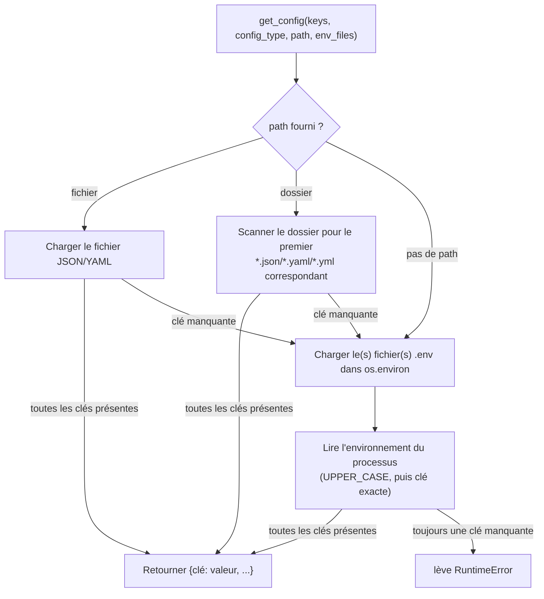
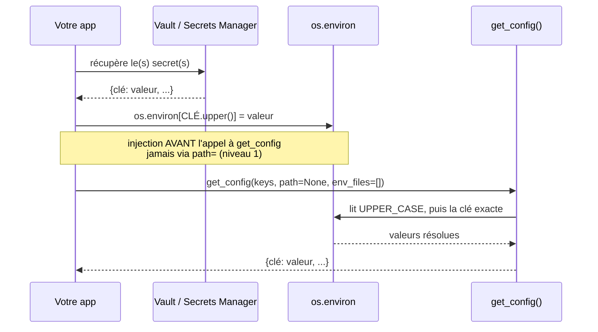

# Gestion des Credentials — OS Helper

[🇫🇷](https://github.com/warith-harchaoui/os-helper/blob/main/GESTION_DES_CREDENTIALS.md) · [🇬🇧](https://github.com/warith-harchaoui/os-helper/blob/main/CREDENTIALS_MANAGEMENT.md)

`os-helper` n'est pas un gestionnaire de secrets, et n'essaie pas de l'être.
Il n'a ni chiffrement, ni intégration au trousseau de l'OS, ni client de
gestionnaire de secrets, ni application automatique d'un `.gitignore`. Ce
document décrit honnêtement ce que la bibliothèque fait réellement avec les
credentials, et le schéma recommandé pour superposer un vrai vault
(HashiCorp Vault, AWS Secrets Manager, GCP Secret Manager, Azure Key
Vault, ...) par-dessus.

---

## Table des matières

1. [Ce que fait os-helper aujourd'hui](#ce-que-fait-os-helper-aujourdhui)
2. [Combiner `get_config` avec un vault](#combiner-get_config-avec-un-vault)
3. [Check-list sécurité](#check-list-sécurité)
4. [Voir aussi](#voir-aussi)

---

## Ce que fait os-helper aujourd'hui

La seule surface en lien avec les credentials dans la bibliothèque est
[`get_config()`](os_helper/config_utils.py) — tout le reste (hachage,
téléchargements, dépôt distant) est soit sans rapport, soit documenté
explicitement ci-dessous.

### Le repli en trois niveaux de `get_config`

`get_config()` résout un ensemble de clés requises selon un ordre fixe et
déterministe — voir [EXEMPLES.md § Chargement de configuration](EXEMPLES.md#chargement-de-configuration)
pour l'API complète :

1. un fichier JSON/YAML explicite, ou le premier fichier correspondant dans
   un dossier ;
2. un ou plusieurs fichiers `.env`, fusionnés dans `os.environ` via
   `python-dotenv` ;
3. les variables d'environnement du processus (`UPPER_CASE` essayé en
   premier, puis la clé exacte telle que fournie).

La fonction renvoie les valeurs résolues sous forme de simple
`dict[str, str | int | float]`. **Rien n'est chiffré, masqué ou expurgé dans
cette valeur de retour** — l'appelant qui détient ce dict détient le secret
en clair.

### La journalisation n'expose jamais les valeurs

La seule chose que `get_config` fait bien par défaut : chaque ligne de log
qu'elle émet nomme le `config_type`, les noms de clés, ou un chemin de
fichier — jamais une valeur résolue :

```
Missing keys in environment variables: db_url, api_key
Configuration 'database' successfully loaded from 'config.yaml'
```

Appeler `get_config` à n'importe quel niveau de verbosité ne fera donc pas
fuiter de secrets dans vos logs. Ce que vous faites du dict renvoyé ensuite
relève de votre responsabilité.



### La surface HTTP API renvoie les valeurs en clair

`POST /config` (`os_helper/api.py`) expose `get_config` par HTTP. Sa
docstring est explicite : `path`/`env_files` sont des chemins **sur le
système de fichiers du serveur** — pensé pour un déploiement de confiance
qui introspecte sa propre configuration locale, pas un moyen de récupérer
les secrets de quelqu'un d'autre par le réseau. Il n'y a aucune
authentification sur l'endpoint lui-même : si vous exposez cette API
publiquement, n'importe quel appelant qui connaît les bons noms de clés
récupère les valeurs en clair. Placez-la derrière votre propre couche
d'authentification (reverse proxy, API gateway) avant de l'exposer au-delà
de localhost.

### Le hachage n'est pas fait pour les mots de passe

`hash_string` / `hashfile` / `hashfolder` utilisent RIPEMD-160 (repli sur
BLAKE2b) pour du **hachage de contenu** — déduplication, contrôles
d'intégrité, identifiants stables. Il n'y a ni salage ni étirement de clé
(pas d'équivalent bcrypt/argon2/scrypt). Ne les utilisez pas pour stocker ou
vérifier des mots de passe.

### Le dépôt distant ne touche jamais aux credentials

`temporary_remote_file()` téléverse vers l'endroit que vous indiquez (S3,
GCS, SFTP, ...) via des callables `upload`/`delete` que *vous* fournissez,
déjà connectés à leurs propres credentials (une session boto3, un client
paramiko, un rôle IAM). os-helper ne voit, ne stocke, ni ne transmet jamais
ces credentials.

### Aucun appel sortant ne transporte de secret

Conformément à la promesse local-first du README, les seuls appels réseau
que la bibliothèque effectue jamais sont `download_file`,
`is_working_url`/`check_url`, et `get_user_ip`. `get_config` ne contacte
jamais de service distant — l'intégration à un vault (ci-dessous) est
entièrement quelque chose que vous ajoutez par-dessus, jamais un
comportement par défaut.

---

## Combiner `get_config` avec un vault

`get_config` n'a pas de niveau vault natif — elle ne connaît que fichier →
`.env` → environnement du processus. Le point d'intégration est le
**niveau 3** : récupérez les secrets depuis le vault d'abord, déposez-les
dans `os.environ`, puis laissez `get_config` les récupérer comme s'ils
avaient toujours été là.

```python
import os
import hvac  # ou boto3 (Secrets Manager), google-cloud-secret-manager, ...
import os_helper as osh

def load_from_vault(vault_client, mount: str, path: str) -> None:
    secret = vault_client.secrets.kv.v2.read_secret_version(mount_point=mount, path=path)
    for key, value in secret["data"]["data"].items():
        os.environ[key.upper()] = str(value)  # get_config essaie UPPER_CASE en premier

client = hvac.Client(url="https://vault.internal", token=os.environ["VAULT_TOKEN"])
load_from_vault(client, mount="secret", path="myapp/prod")

# path=None, env_files=[] saute entièrement les niveaux fichier et .env —
# directement vers les variables d'environnement injectées ci-dessus.
config = osh.get_config(
    keys=["db_url", "api_key"],
    config_type="myapp",
    path=None,
    env_files=[],
)
```

Le même schéma s'applique à n'importe quel client de vault : remplacez
`hvac` par `get_secret_value` de `boto3`, `google.cloud.secretmanager`, ou
`azure.keyvault.secrets` — seul l'appel de récupération change, pas le
point d'injection.



### Deux décisions à prendre délibérément

- **Injectez dans l'environnement, jamais dans le niveau fichier.** Faire
  transiter un secret récupéré du vault par `get_config(path=...)` signifie
  l'écrire sur disque — même dans un fichier temporaire, cela annule
  l'intérêt du vault. L'injection dans l'environnement garde les secrets en
  mémoire uniquement, au prix d'être visibles par tout sous-processus lancé
  par `system()` (les processus enfants héritent de l'environnement).

- **Parité dev/prod, si vous la voulez.** `load_dotenv()` (niveau 2)
  n'écrase pas par défaut les clés déjà présentes dans `os.environ`. Donc si
  vous appelez `load_from_vault(...)` *avant* `get_config`, les valeurs
  fournies par le vault deviennent le plancher, et un fichier `.env` local
  d'un développeur peut toujours surcharger des clés individuelles en
  développement local — le vault comble ce que le `.env` ne définit pas,
  sans aucune branche de code entre les environnements.

---

## Check-list sécurité

- [ ] Ne jamais logger le dict renvoyé par `get_config`, seulement le fait
      qu'elle a réussi (la bibliothèque suit déjà cette règle en interne).
- [ ] Ne jamais faire transiter des secrets récupérés du vault par
      `get_config(path=...)` — cela les écrit sur disque. Utilisez
      l'injection dans l'environnement à la place.
- [ ] Gardez les fichiers `.env` hors du contrôle de version (os-helper ne
      l'impose pas — c'est une simple lecture de fichier ; ajoutez `.env` au
      `.gitignore` de votre propre projet).
- [ ] N'exposez pas `POST /config` de la surface HTTP API au-delà de
      localhost sans votre propre couche d'authentification devant.
- [ ] Rappelez-vous que les sous-processus lancés par `system()` héritent de
      tout l'environnement du processus — un secret injecté via le vault est
      visible par chaque commande shellée, pas seulement votre propre code
      Python.
- [ ] os-helper n'a aucune conscience de la rotation des credentials — si
      votre vault fait tourner un secret, votre processus a besoin de sa
      propre stratégie de redémarrage/rafraîchissement ; `get_config` ne
      résout qu'une seule fois, au moment de l'appel.

## Voir aussi

- [EXEMPLES.md § Chargement de configuration](EXEMPLES.md#chargement-de-configuration) —
  l'API `get_config` nue et son ordre de repli, sans la couche vault.
- [LISEZMOI.md § La promesse](LISEZMOI.md#la-promesse) — la posture réseau
  local-first de la bibliothèque.
